# AquaGuardian Architecture

This document provides a comprehensive overview of AquaGuardian's technical architecture, data flow, and system design decisions.

## 🏗️ System Overview

AquaGuardian is a full-stack web application built with modern technologies to provide aquaponic system design, simulation, and tokenization capabilities.

### Architecture Principles

- **Modular Design**: Clear separation of concerns across components
- **Type Safety**: TypeScript throughout the application
- **Responsive First**: Mobile-optimized with desktop enhancement
- **Performance Focused**: Optimized for Core Web Vitals
- **Security by Design**: Row-level security and proper authentication

## 🔧 Technology Stack

### Frontend Layer

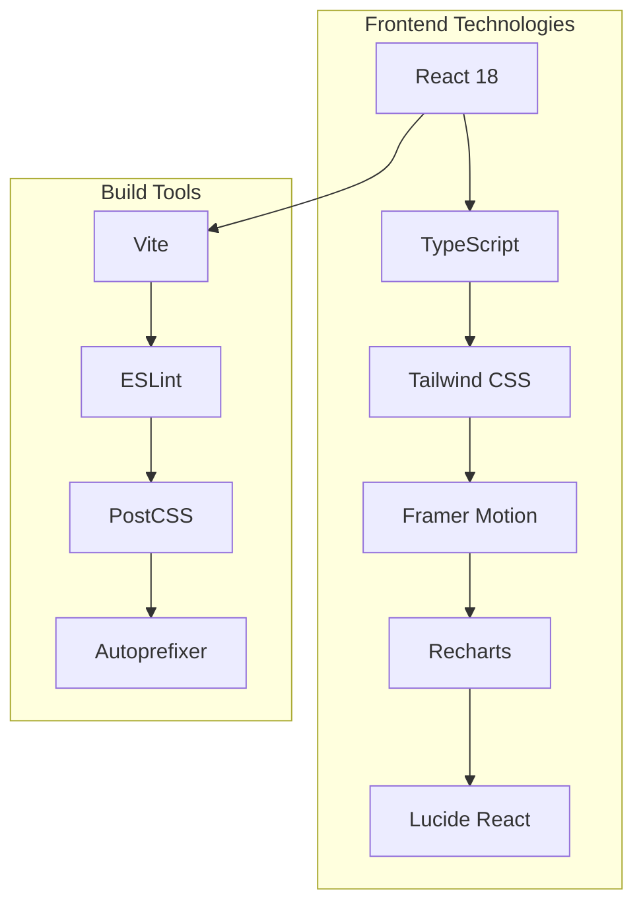

**Key Technologies:**
- **React 18**: Component-based UI with concurrent features
- **TypeScript**: Type-safe development with strict configuration
- **Tailwind CSS**: Utility-first styling with custom design system
- **Framer Motion**: Smooth animations and micro-interactions
- **Recharts**: Interactive data visualization
- **Vite**: Fast development and optimized builds

### Backend & Infrastructure

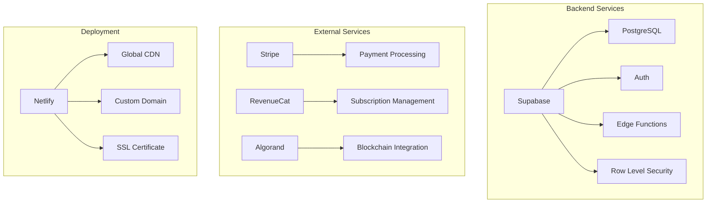

**Key Services:**
- **Supabase**: Backend-as-a-Service with PostgreSQL, authentication, and real-time features
- **Stripe**: Payment processing and subscription management
- **RevenueCat**: Cross-platform subscription analytics
- **Algorand**: Carbon-negative blockchain for asset tokenization
- **Netlify**: Global deployment with CDN and custom domain

## 📊 Data Architecture

### Database Schema

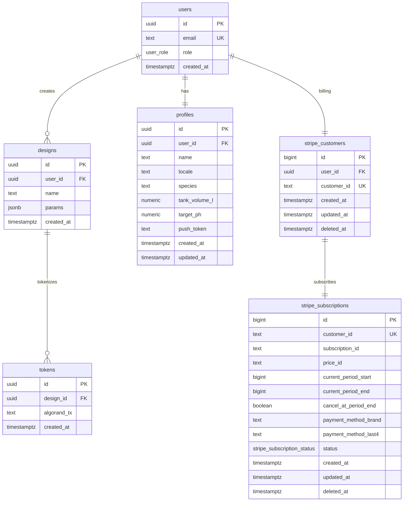

### Row Level Security (RLS)

All tables implement RLS policies for data isolation:

```sql
-- Example: Users can only access their own designs
CREATE POLICY "Users can manage own designs" 
ON designs 
FOR ALL 
TO authenticated 
USING (user_id = auth.uid());
```

## 🔄 Data Flow Architecture

### Application Flow

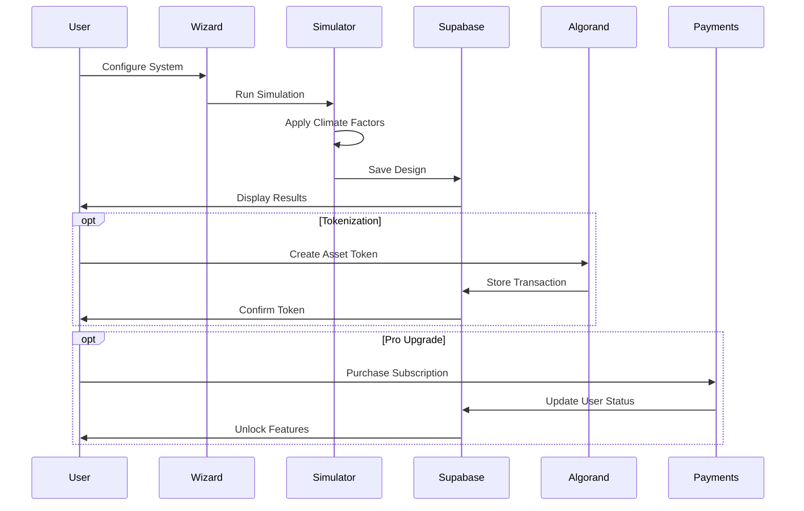

### Simulation Engine Flow

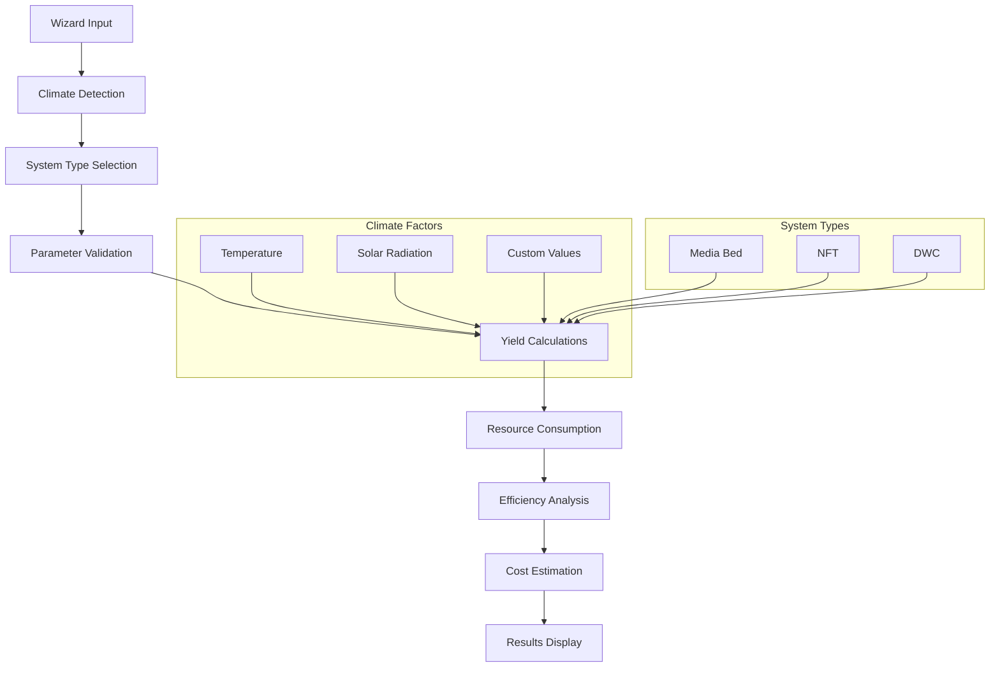

## 🧩 Component Architecture

### Component Hierarchy

```
App
├── AuthProvider
│   ├── ThemeProvider
│   │   ├── SubscriptionProvider
│   │   │   ├── Layout
│   │   │   │   ├── Sidebar Navigation
│   │   │   │   └── Main Content
│   │   │   │       ├── Wizard
│   │   │   │       ├── Dashboard
│   │   │   │       ├── MyDesignsPage
│   │   │   │       ├── Marketplace
│   │   │   │       ├── Settings
│   │   │   │       └── Billing
│   │   │   └── Modals & Dialogs
│   │   └── Theme Toggle
│   └── Authentication
└── Router
```

### State Management

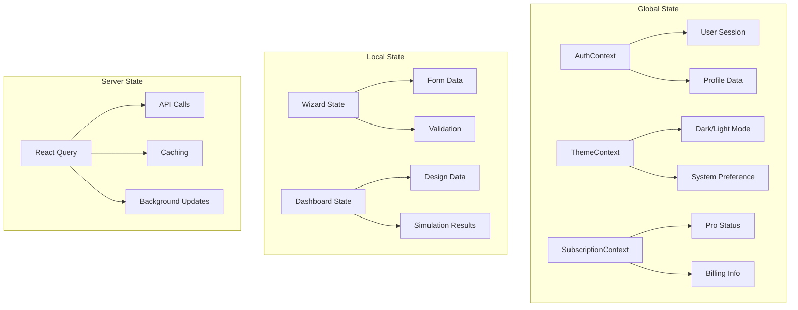

## 🔐 Security Architecture

### Authentication Flow

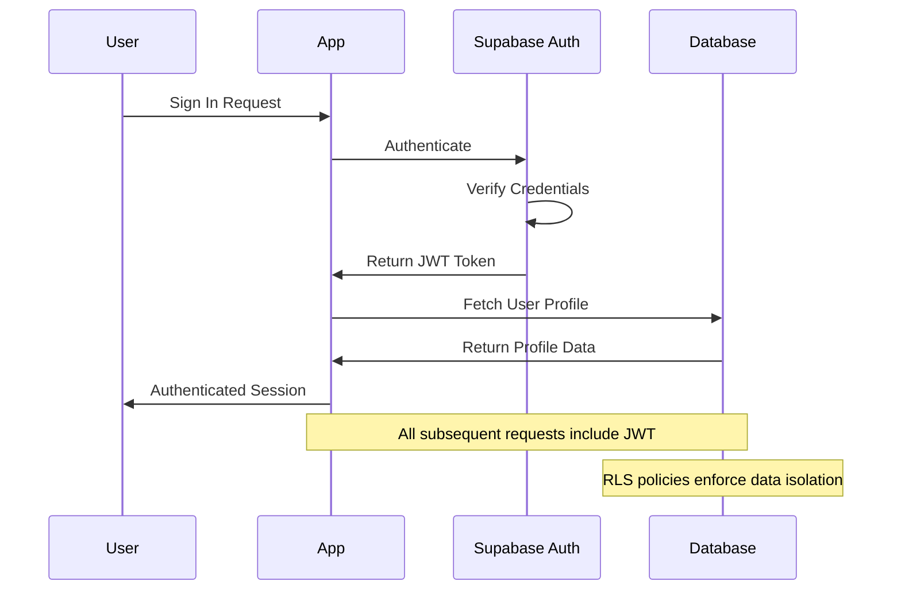

### Security Measures

1. **Row Level Security (RLS)**: Database-level access control
2. **JWT Authentication**: Secure token-based authentication
3. **Environment Variables**: Sensitive data protection
4. **HTTPS Only**: All communications encrypted
5. **Input Validation**: Client and server-side validation
6. **CORS Configuration**: Proper cross-origin resource sharing

## 🚀 Performance Architecture

### Optimization Strategies

```mermaid
graph TB
    subgraph "Frontend Optimizations"
        A[Code Splitting] --> B[Lazy Loading]
        B --> C[Tree Shaking]
        C --> D[Bundle Analysis]
    end
    
    subgraph "Runtime Optimizations"
        E[React.memo] --> F[useMemo/useCallback]
        F --> G[Virtual Scrolling]
        G --> H[Image Optimization]
    end
    
    subgraph "Network Optimizations"
        I[CDN Delivery] --> J[Compression]
        J --> K[Caching Headers]
        K --> L[Preloading]
    end
```

### Performance Metrics

- **Lighthouse Score**: 90+ on mobile
- **First Contentful Paint**: < 1.5s
- **Largest Contentful Paint**: < 2.5s
- **Cumulative Layout Shift**: < 0.1
- **Bundle Size**: < 5MB total

## 🔄 CI/CD Pipeline

### Deployment Flow

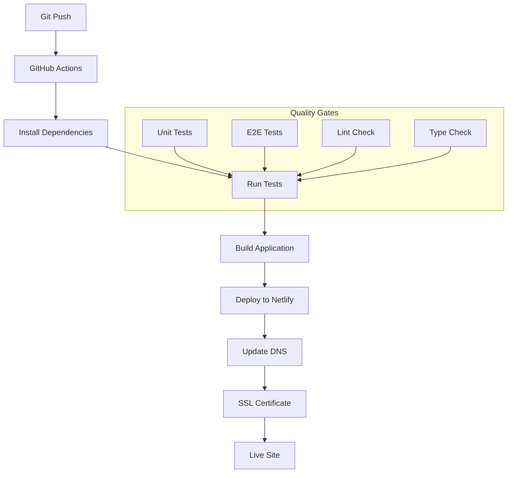

### Environment Management

- **Development**: Local development with hot reload
- **Staging**: Preview deployments for testing
- **Production**: Live site with custom domain

## 📱 Mobile Architecture

### Responsive Design Strategy

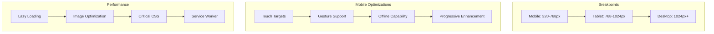

## 🧪 Testing Architecture

### Testing Strategy

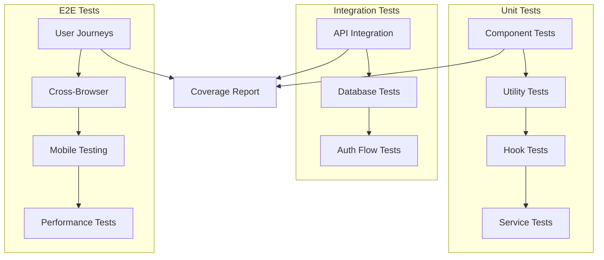

### Test Coverage Requirements

- **Statements**: 80%
- **Branches**: 80%
- **Functions**: 80%
- **Lines**: 80%

## 🔮 Future Architecture Considerations

### Scalability Improvements

1. **Microservices**: Split simulation engine into separate service
2. **Caching Layer**: Redis for frequently accessed data
3. **Message Queue**: Background job processing
4. **API Gateway**: Rate limiting and request routing
5. **Database Sharding**: Horizontal scaling for large datasets

### Technology Evolution

1. **React Server Components**: Server-side rendering improvements
2. **Edge Computing**: Move simulation closer to users
3. **WebAssembly**: High-performance calculations
4. **Progressive Web App**: Native app-like experience
5. **Real-time Collaboration**: Multi-user design sessions

## 📊 Monitoring & Observability

### Application Monitoring

- **Error Tracking**: Sentry for error monitoring
- **Performance Monitoring**: Web Vitals tracking
- **User Analytics**: Privacy-focused analytics
- **Uptime Monitoring**: Service availability tracking

### Business Metrics

- **User Engagement**: Design creation rates
- **Conversion Metrics**: Free to Pro upgrades
- **System Performance**: Simulation accuracy
- **Support Metrics**: Response times and resolution rates

---

This architecture supports AquaGuardian's mission of democratizing sustainable agriculture through technology while maintaining high performance, security, and scalability standards.