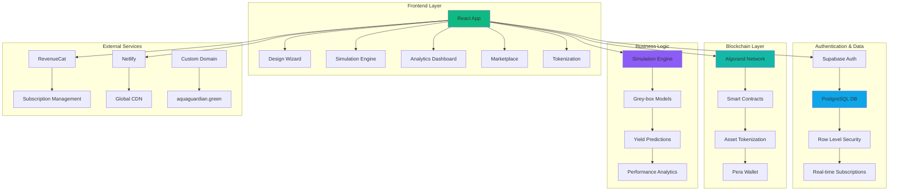
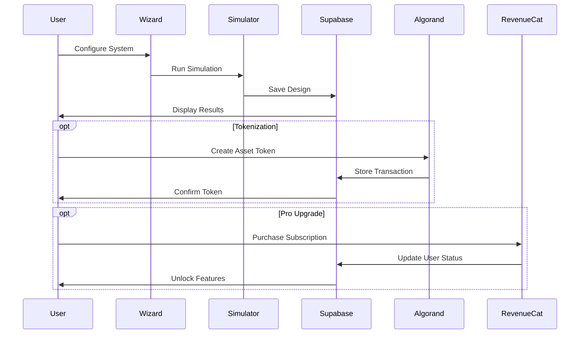

# AquaGuardian - Sustainable Aquaponic System Design Platform

## 🌱 Inspiration / Problem

The global food crisis is intensifying with climate change, population growth, and diminishing arable land. Traditional agriculture consumes 70% of freshwater resources while producing only 60% of the food we need. Urban areas lack access to fresh, locally-grown produce, creating food deserts and increasing carbon footprints from transportation.

**The Problem We're Solving:**
- 🌍 **Food Security**: 828 million people face acute food insecurity globally
- 💧 **Water Scarcity**: Agriculture uses 70% of freshwater but wastes 60% through inefficient methods
- 🏙️ **Urban Food Deserts**: 23.5 million Americans live in areas without access to fresh produce
- 💰 **High Barrier to Entry**: Aquaponic system design requires expensive consultants and complex calculations
- 🔗 **Lack of Investment Access**: Small-scale farmers can't access capital for sustainable agriculture

## 🚀 What It Does

AquaGuardian is a comprehensive platform that democratizes sustainable agriculture through intelligent aquaponic system design, real-time performance simulation, and blockchain-powered investment opportunities.

### Core Features

**🧙‍♂️ Intelligent Design Wizard**
- Step-by-step configuration for farm size, fish species, crops, budget, and energy source
- AI-powered compatibility checking and optimization recommendations
- Beginner-friendly interface with expert-level precision

**📊 Advanced Performance Simulation**
- Real-time yield predictions using grey-box modeling
- Water usage, energy consumption, and efficiency calculations
- 30-day cumulative performance projections with interactive charts
- ROI analysis and break-even calculations

**🔗 Blockchain Asset Tokenization**
- Convert aquaponic systems into tradeable digital assets on Algorand
- Enable fractional ownership for community-supported agriculture
- Performance-based token valuation tied to actual system metrics
- Carbon-negative blockchain integration for sustainable transactions

**📈 Analytics Dashboard**
- Beautiful data visualization with Recharts integration
- System efficiency monitoring and optimization suggestions
- Resource consumption tracking and sustainability metrics
- Export capabilities for detailed reporting

**🏪 Community Marketplace**
- Discover and share aquaponic designs from the global community
- Advanced filtering by efficiency, species, crops, and system size
- Social features with likes, views, and design sharing
- Pro analytics for market trends and performance benchmarks

### Pro Designer Subscription ($9/month)
- ♾️ Unlimited system simulations
- 📊 Advanced analytics and comparisons
- 🪙 Unlimited blockchain token minting
- 🎯 Priority customer support
- 📄 Detailed PDF exports and commercial usage rights

## 🛠️ Tech Stack & Architecture

### Frontend Stack
- **React 18** with TypeScript for type-safe component development
- **Tailwind CSS** for responsive, utility-first styling
- **Framer Motion** for smooth animations and micro-interactions
- **Recharts** for interactive data visualization
- **Lucide React** for consistent iconography

### Backend & Database
- **Supabase** for PostgreSQL database, authentication, and real-time subscriptions
- **Row Level Security (RLS)** for data isolation and security
- **Edge Functions** for serverless API endpoints

### Blockchain Integration
- **Algorand SDK** for carbon-negative blockchain transactions
- **AlgoKit Utils** for streamlined smart contract interactions
- **Pera Wallet** integration for seamless user experience

### Payments & Subscriptions
- **RevenueCat Web SDK** for cross-platform subscription management
- **Stripe** integration for secure payment processing

### Development & Deployment
- **Vite** for fast development and optimized builds
- **Vitest** for comprehensive testing coverage
- **ESLint** for code quality and consistency
- **Netlify** for global CDN deployment with custom domain

### Data Flow Architecture

## 🏆 Algorand Challenge Fit

AquaGuardian perfectly aligns with Algorand's mission of building a sustainable, inclusive financial ecosystem:

### 🌍 Sustainability Impact
- **Carbon-Negative Blockchain**: Algorand's proof-of-stake consensus uses minimal energy
- **Sustainable Agriculture**: Aquaponics uses 90% less water than traditional farming
- **Local Food Production**: Reduces transportation emissions and supports food security
- **Circular Economy**: Fish waste becomes plant nutrients in closed-loop systems

### 💰 Financial Inclusion
- **Fractional Ownership**: Enable small investors to participate in sustainable agriculture
- **Community-Supported Agriculture**: Tokenize farm shares for local food security
- **Micropayments**: Low transaction fees enable small-scale agricultural investments
- **Global Access**: Borderless transactions for international agricultural development

### 🔗 Technical Innovation
- **Asset Tokenization**: Convert physical aquaponic systems into digital assets
- **Performance-Based Valuation**: Token value tied to actual yield and efficiency metrics
- **Smart Contracts**: Automated profit-sharing based on system performance
- **Interoperability**: Seamless integration with existing DeFi protocols

### 📊 Real-World Utility
- **Transparent Operations**: Immutable records of system performance and yields
- **Automated Compliance**: Smart contracts ensure regulatory compliance
- **Data Integrity**: Blockchain verification of agricultural data and certifications
- **Supply Chain Tracking**: From seed to harvest transparency

### Use Case Examples

1. **Urban Farm Tokenization**: A rooftop aquaponic farm in Detroit tokenizes ownership, allowing community members to invest $50-$500 and receive fresh produce dividends

2. **International Development**: NGOs use AquaGuardian to design and fund aquaponic systems in food-insecure regions, with transparent blockchain tracking of impact metrics

3. **Corporate ESG**: Companies purchase carbon credits through verified aquaponic projects, with real-time monitoring of environmental impact

4. **Educational Institutions**: Schools design and simulate aquaponic systems, then tokenize them for student-led investment learning

## 📸 Screenshots

### Design Wizard Interface

*Step-by-step aquaponic system configuration with intelligent recommendations*

### Performance Simulation Dashboard

*Real-time yield predictions and resource consumption analysis*

### Analytics & Visualization

*30-day cumulative performance tracking with interactive charts*

### Blockchain Tokenization

*Asset tokenization on Algorand with performance-based valuation*

### Community Marketplace

*Discover and share aquaponic designs from the global community*

### Pro Designer Features

*Advanced analytics and unlimited simulations for professional users*

## 🎯 Impact & Future Vision

### Immediate Impact
- **Democratize Aquaponics**: Make sustainable agriculture accessible to everyone
- **Reduce Barriers**: Eliminate need for expensive consultants and complex calculations
- **Enable Investment**: Connect capital with sustainable agriculture projects
- **Build Community**: Create global network of sustainable agriculture practitioners

### Long-term Vision
- **Food Security**: Contribute to feeding 10 billion people by 2050
- **Climate Action**: Reduce agricultural water usage by 90% in participating systems
- **Economic Empowerment**: Create new income streams for urban and rural communities
- **Technology Transfer**: Spread sustainable agriculture knowledge globally

### Measurable Goals
- 🎯 **10,000 systems designed** in first year
- 💧 **1 million gallons of water saved** annually
- 🌱 **100,000 kg of food produced** through platform-designed systems
- 💰 **$1 million in tokenized agricultural assets** by year two

## 🔗 Links & Resources

- **Live Demo**: [aquaguardian.green](https://aquaguardian.green)
- **GitHub Repository**: [github.com/aquaguardian/platform](https://github.com/aquaguardian/platform)
- **Video Demo**: [YouTube Demo](https://youtube.com/watch?v=demo)
- **Algorand Explorer**: [View Transactions](https://testnet.algoexplorer.io)
- **Technical Documentation**: [docs.aquaguardian.green](https://docs.aquaguardian.green)

---

*Built with ❤️ for sustainable agriculture and powered by Algorand's carbon-negative blockchain*